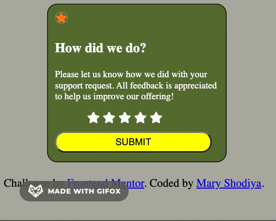

# Frontend Mentor - Interactive rating component solution

This is a solution to the [Interactive rating component challenge on Frontend Mentor](https://www.frontendmentor.io/challenges/interactive-rating-component-koxpeBUmI). Frontend Mentor challenges help you improve your coding skills by building realistic projects. 


### The challenge

Users should be able to:

- View the optimal layout for the app depending on their device's screen size
- See hover states for all interactive elements on the page
- Select and submit a star rating
- See the "Thank you" card state after submitting a rating

### Gif




### Links

- Solution URL: [Add solution URL here](https://your-solution-url.com)
- Live Site URL: [Live Site URL here](https://responsive-rating-ibao1xf1h-maryshodiya.vercel.app/)

## My process

### Built with

- Semantic HTML5 markup
- CSS custom properties
- Javascript


### What I learned
Learnt how to grab a list of icons and loop through the list of icons to return its index to the DOM through creating an empty array and linking the icons to the array before looping through each array 

```js
let selectedStars = Array.from(icons).indexOf(event.target)
    if (stars.includes(event.target.id)){
        stars.splice(selectedStars, stars.length)
      for (let i = selectedStars; i <= icons.length-1; i++)  {
      icons[i].style.color = 'black' 
      icons[i] .className= 'fas  fa-star star'  
      }
```


### Continued development

Would love to explore further features in the area of adding more functionality to an icon list


### Useful resources

- [Resource](https://www.w3schools.com/howto_css_star_rating.asp) - This helped me in modifying the icons functionality. I will use it going forward and would definitely recommend to any one going forward.


## Author

- Website - [Mary Shodiya](https://maryshodiya.netlify.app)
- Frontend Mentor - [@yourusername](https://www.frontendmentor.io/profile/MaryShodiya)
- Twitter - [@yourusername](https://www.twitter.com/addvokeight)


